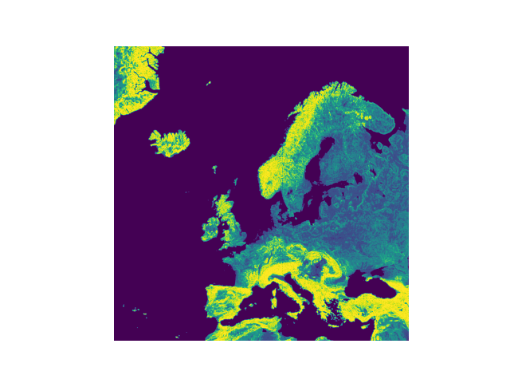

# ASEiED_2023_Bienkowski_Goralski_Makowski

### Exercise
Perform an analysis of data containiing information about terrain elevation variations by selecting groups of areas with the highr=est increasses (continent: Europe). Elevation increase in a given location should be measured based on at least 10 data points. Determine 5 groups of areas based on the average elevation increase. Plot the identified areas on a map.

### Data
We used terrain-tiles dataset available via AWS resources. Link to data: https://registry.opendata.aws/terrain-tiles/

### Technologies and libraries used in project
Technologies: 
- PySpark
- Cluster configurations:
  software - Hadoop 2.10.1, Hive 2.3.9, Hue 4.10.0, JupyterEnterpriseGateway 2.1.0, Pig 0.17.0, Spark 2.4.8
  hardware - m5.xlarge
- EMR cluster - EMR 5.36.0
- S3 cloud storage - source data: s3://elevation-tiles-prod//terrarium/

Libraries:
- opencv-python
- numpy
- matplotlib
- math
- pyspark

### Definited functions

Convert degrees to tile numbers
* convert_deg_to_num()
    
Convert tile numbers to degrees
* convert_num_to_deg()
    
Plot an image
* plot_img()
    
Plot the map
* plot_map()
    
Get the height from data
* get_height()
    
Get the URLs of tiles for a given area
* get_tiles_url()
    
Create groups based on elevation increase
* create_groups()
    
Process the map view based on groups
* process_map_view()
    
Color the map based on elevation groups
* colour()
    
Extract the index from a file path
* to_idx()
    
Extract the index from a file path
* to_idy()
    
Main function to execute the project
* main()

### Shorted description of operation 
1.  Data Retrieval: The program starts by defining a specific area of Europe with designated coordinates. It then uses the get_tiles_url function to retrieve image data from this area, along with information about intervals on the x and y axes.

2.  Data Processing: The image data is loaded and transformed into an appropriate DataFrame structure using Spark. Only essential columns containing information about the source and image data are selected.

3.  Index Creation: User-defined functions (UDFs) called new_idx and new_idy are used to calculate the 'idx' and 'idy' indexes for each image based on source information.

4.  Data Sorting: The DataFrame is sorted based on the 'idx' and 'idy' indexes to maintain the correct data order.

5.  Gradient Calculation: The program calculates image gradients using Sobel filters along the x and y axes. The gradient results are transformed into NumPy arrays.

6.  Color Map Creation and Saving: Based on the gradient results and grouping, a color map is generated. The program then creates a color map chart with intervals on the x and y axes. The final color map is saved to file.

### Results

